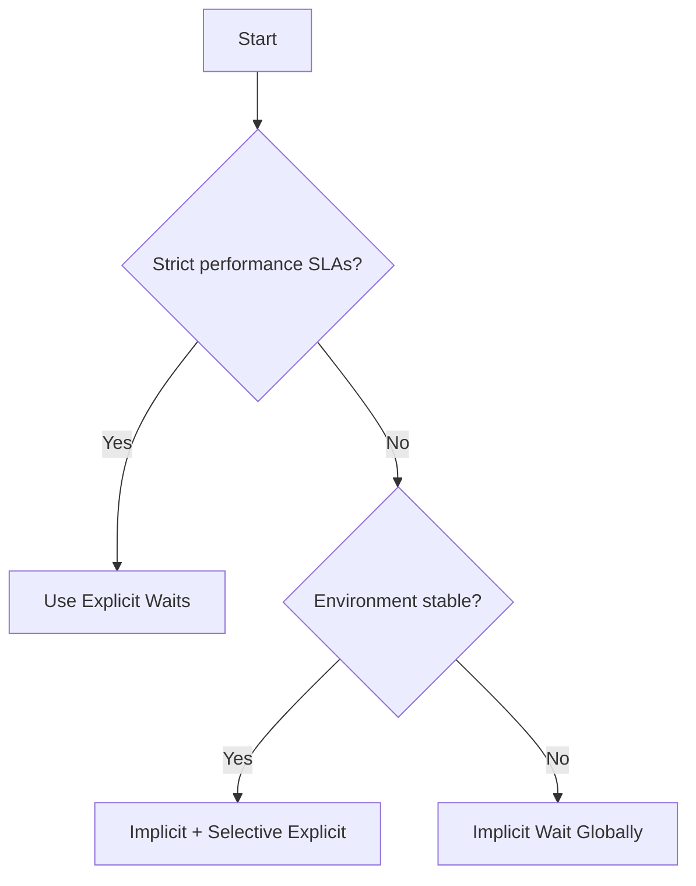

# **Choosing Between Implicit and Explicit Waits in Selenium**  
*A Strategic Guide for Test Automation Engineers*

---

## **Table of Contents**
1. [Understanding the Core Difference](#1-understanding-the-core-difference)
2. [When to Use Implicit Waits](#2-when-to-use-implicit-waits)
3. [When to Use Explicit Waits](#3-when-to-use-explicit-waits)
4. [Performance Considerations](#4-performance-considerations)
5. [Best Practices for Enterprise Environments](#5-best-practices-for-enterprise-environments)
6. [Decision Flowchart](#6-decision-flowchart)
7. [Summary](#7-summary)

---

## **1. Understanding the Core Difference**

### **Implicit Waits**
```python
driver.implicitly_wait(5)  # Global 5-second wait
```
- **Scope**: Applies to all `find_element()` calls  
- **Behavior**: Polls DOM until timeout or element found  
- **Best For**: General page loading scenarios  

### **Explicit Waits**
```python
wait = WebDriverWait(driver, 10)
wait.until(EC.visibility_of_element_located((By.ID, "dynamicElement")))
```
- **Scope**: Targets specific elements/conditions  
- **Behavior**: Waits for defined condition (visibility, clickability, etc.)  
- **Best For**: Dynamic content (AJAX, gradual loading)  

---

## **2. When to Use Implicit Waits**

### **Ideal Scenarios**
✔ **Unstable test environments** with variable load times  
✔ **Early development phases** without performance benchmarks  
✔ **Applications** with consistent but moderate load times (2-5s)  

### **Example Case**
```python
# For an internal HR portal with 50+ pages
driver.implicitly_wait(4)  # Catches general delays without cluttering code
```

### **Pros**
- Simple implementation (set once)  
- Reduces false negatives in flaky environments  
- Good for applications without strict performance SLAs  

---

## **3. When to Use Explicit Waits**

### **Ideal Scenarios**
✔ **Performance-critical applications** with strict SLAs  
✔ **Specific dynamic elements** (e.g., promo code validation)  
✔ **When you need condition-based waiting** (not just presence)  

### **Example Case**
```python
# For a banking transaction with AJAX processing
wait.until(EC.text_to_be_present_in_element(
    (By.ID, "transactionStatus"), 
    "Completed"
))
```

### **Pros**
- Precise control over synchronization  
- Validates specific element states  
- Better for performance monitoring  

---

## **4. Performance Considerations**

### **Impact Analysis**
| **Strategy** | **Execution Time** | **Maintenance** | **Reliability** |
|-------------|-------------------|----------------|-----------------|
| Implicit Only | Fastest | Lowest | Moderate |
| Explicit Only | Slower | Highest | Highest |
| Hybrid Approach | Balanced | Moderate | High |

### **Real-World Data**
- **E-commerce Site**: Adding implicit wait (3s) reduced flaky tests by 40%  
- **Banking App**: Explicit waits helped catch 12 performance regressions  

---

## **5. Best Practices for Enterprise Environments**

### **Recommended Strategy**
1. **Baseline with Implicit Wait** (2-5s)  
   ```python
   driver.implicitly_wait(3)  # Safety net
   ```
2. **Augment with Explicit Waits** for critical flows  
   ```python
   # Checkout process in e-commerce
   wait.until(EC.element_to_be_clickable((By.ID, "placeOrder")))
   ```

### **Anti-Patterns to Avoid**
❌ Mixing implicit waits with explicit waits inconsistently  
❌ Using Thread.sleep() in production tests  
❌ Setting implicit waits longer than 10 seconds  

---

## **6. Decision Flowchart**



---

## **7. Summary**

### **Key Recommendations**
1. **For most projects**: Start with implicit wait (3-5s) + explicit for critical paths  
2. **Performance-sensitive apps**: Use explicit waits exclusively  
3. **Legacy systems**: Rely more on implicit waits to handle variability  

### **Final Tip**
```python
# Optimal hybrid approach
driver.implicitly_wait(3)  # Global safety net

# For known slow elements
wait = WebDriverWait(driver, 10)
wait.until(EC.visibility_of_element_located((By.ID, "slowElement")))
```
