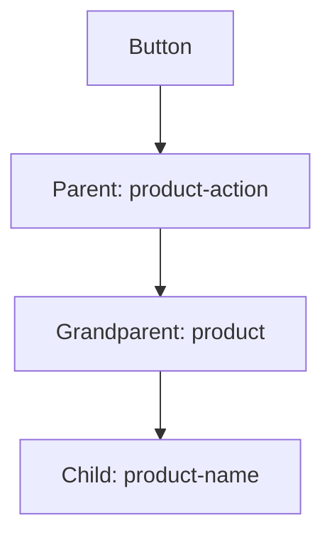

# **Mastering XPath Traversal in Selenium: Parent-Child Navigation**  
*A Comprehensive Guide to Optimizing Web Element Interactions*

---

## **Table of Contents**
1. [Understanding the Challenge](#1-understanding-the-challenge)
2. [XPath Parent-Child Navigation](#2-xpath-parent-child-navigation)
3. [Practical Implementation](#3-practical-implementation)
4. [Optimizing Test Code](#4-optimizing-test-code)
5. [Best Practices](#5-best-practices)
6. [Summary](#6-summary)

---

## **1. Understanding the Challenge**

### **Scenario: E-commerce Cart Validation**
- **Goal**: Verify products added on page 1 appear in page 2's cart
- **Problem**: Need to extract product names from dynamically loaded elements
- **Initial Approach**:
  ```python
  # Traditional method - Two separate loops
  products_page1 = driver.find_elements(By.XPATH, "//h4[@class='product-name']")
  # Later after navigation...
  products_page2 = driver.find_elements(By.XPATH, "//p[@class='product-name']")
  ```

### **Pain Points**
- Duplicate code for similar operations
- Inefficient DOM traversals
- Hard to maintain when UI changes

---

## **2. XPath Parent-Child Navigation**

### **Key Concepts**


### **XPath Axes for Navigation**
| **Direction** | **XPath Syntax** | **Description** |
|--------------|------------------|-----------------|
| Parent | `../` or `/parent::node()` | Immediate parent |
| Ancestor | `/ancestor::div` | Any level parent |
| Following-sibling | `/following-sibling::div` | Horizontal traversal |

### **Why This Matters**
✔ **Single-loop efficiency** - Get multiple related elements in one pass  
✔ **Context-aware searching** - Precise element location  
✔ **Resilient to partial UI changes** - Relative paths survive layout tweaks  

---

## **3. Practical Implementation**

### **Optimized Solution Code**
```python
# Initialize list to store product names
products_added = []

# Single loop to both click buttons AND capture names
buttons = driver.find_elements(By.XPATH, "//div[@class='product-action']/button")

for button in buttons:
    # Traverse up to grandparent then down to product name
    product_name = button.find_element(
        By.XPATH, 
        "parent::div/parent::div/h4"
    ).text
    
    products_added.append(product_name)
    button.click()  # Original button action

print("Products added:", products_added)
```

### **Execution Flow**
1. Locate all "Add to Cart" buttons
2. For each button:
   - Navigate up 2 levels to product container
   - Find product name element
   - Store text before clicking
3. Continue with test flow

---

## **4. Optimizing Test Code**

### **Before vs After Optimization**
| **Metric** | **Traditional Approach** | **Optimized Approach** |
|------------|-------------------------|-----------------------|
| DOM queries | 2n (n=products) | n |
| Code lines | ~15 | ~8 |
| Maintenance | Fragile | Resilient |
| Readability | Low | High |

### **Advanced Technique: Chained Finds**
```python
# Alternative syntax using chained finds
product_name = (button
    .find_element(By.XPATH, "..")  # Immediate parent
    .find_element(By.XPATH, "..")  # Grandparent
    .find_element(By.TAG_NAME, "h4")
    .text)
```

---

## **5. Best Practices**

### **Do's and Don'ts**
✔ **Do**:
- Use relative XPaths (`..`) for parent navigation
- Cache commonly used parent elements
- Combine with CSS selectors when possible

❌ **Don't**:
- Over-navigate (more than 2-3 levels up)
- Hardcode absolute paths
- Mix implicit waits with complex traversals

### **Debugging Tips**
```python
# Print full XPath for debugging
print(button.find_element(By.XPATH, "parent::div/parent::div").get_attribute("outerHTML"))
```

---

## **6. Summary**

### **Key Takeaways**
1. **XPath parent navigation** (`..` or `parent::`) enables efficient multi-element operations  
2. **Single-loop patterns** reduce code complexity and execution time  
3. **Contextual searching** makes tests more resilient to UI changes  


🚀 **Pro Tip**: Combine this technique with Page Object Model for enterprise-grade test frameworks!

```python
# Final optimized version with validation
cart_products = [p.text for p in driver.find_elements(By.CSS_SELECTOR, ".cartSection p")]
assert set(products_added) == set(cart_products), "Cart items mismatch!"
```
