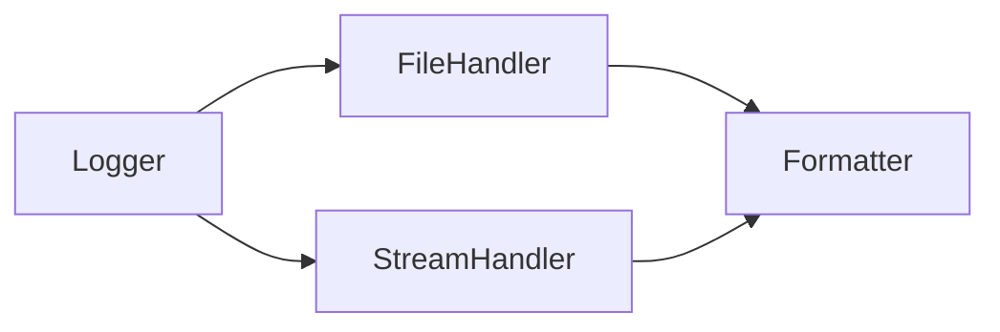

# **Mastering Logging Configuration in Python**

## **Complete Guide to Logging Setup**

### **Table of Contents**
1. [Formatting Log Messages](#formatting-log-messages)
2. [Connecting Formatters to Handlers](#connecting-formatters-to-handlers)
3. [Understanding Log Levels Hierarchy](#understanding-log-levels-hierarchy)
4. [Practical Implementation](#practical-implementation)
5. [Dynamic Log Level Control](#dynamic-log-level-control)

---

## **1. Formatting Log Messages**  
**Objective:** Structure logs with timestamps, levels, and context.

### **Log Format Components**
```python
formatter = logging.Formatter(
    "%(asctime)s - %(levelname)s - %(name)s - %(message)s",
    datefmt="%Y-%m-%d %H:%M:%S"
)
```

| Variable       | Description                          | Example Output              |
|----------------|--------------------------------------|-----------------------------|
| `%(asctime)s`  | Timestamp                            | `2023-10-05 14:30:45`       |
| `%(levelname)s`| Log severity (DEBUG/INFO/ERROR)      | `INFO`                      |
| `%(name)s`     | Module name                          | `test_login`                |
| `%(message)s`  | Custom log message                   | "User logged in successfully"|

**Key Insight:**  
The formatter uses `%`-style formatting (similar to C's `printf`) to dynamically insert runtime values.

---

## **2. Connecting Formatters to Handlers**  
**How Logging Components Interconnect:**



### **Step-by-Step Connection**
1. **Create a Formatter**
   ```python
   formatter = logging.Formatter("%(asctime)s - %(levelname)s - %(message)s")
   ```

2. **Attach to Handlers**
   ```python
   file_handler = logging.FileHandler("app.log")
   file_handler.setFormatter(formatter)  # Critical connection
   ```

3. **Add to Logger**
   ```python
   logger = logging.getLogger(__name__)
   logger.addHandler(file_handler)
   ```

**Why This Matters:**  
This chain ensures logs are:
- Captured by the logger  
- Processed by handlers  
- Formatted before output  

---

## **3. Understanding Log Levels Hierarchy**  
**Log Level Severity (Low to High):**
```
DEBUG < INFO < WARNING < ERROR < CRITICAL
```

### **Filtering with `setLevel()`**
```python
logger.setLevel(logging.WARNING)  # Only WARNING+ will log
```

**Practical Scenarios:**
| Level Set | What Gets Logged              | Use Case                     |
|-----------|-------------------------------|------------------------------|
| `DEBUG`   | All messages                  | Development troubleshooting  |
| `INFO`    | INFO and higher               | Normal test execution        |
| `ERROR`   | Only errors/critical          | Production monitoring        |

**Example:**
```python
logger.debug("Hidden")      # Won't log if level=INFO
logger.warning("Visible")   # Will log
```

---

## **4. Practical Implementation**  
### **Complete Logging Setup**
```python
import logging

def setup_logger():
    # 1. Create Logger
    logger = logging.getLogger(__name__)
    logger.setLevel(logging.DEBUG)  # Capture all levels
    
    # 2. Create Handlers
    file_handler = logging.FileHandler("test.log")
    console_handler = logging.StreamHandler()
    
    # 3. Set Handler Levels
    file_handler.setLevel(logging.DEBUG)      # File gets all logs
    console_handler.setLevel(logging.WARNING) # Console only shows WARNING+
    
    # 4. Create Formatter
    formatter = logging.Formatter(
        "%(asctime)s - %(levelname)s - %(name)s - %(message)s",
        datefmt="%Y-%m-%d %H:%M:%S"
    )
    
    # 5. Attach Formatter
    file_handler.setFormatter(formatter)
    console_handler.setFormatter(formatter)
    
    # 6. Add Handlers to Logger
    logger.addHandler(file_handler)
    logger.addHandler(console_handler)
    
    return logger

# Usage
logger = setup_logger()
logger.info("Test started")          # Goes to file only
logger.error("Payment failed!")      # Goes to both file and console
```

**Output in `test.log`:**
```
2023-10-05 14:30:45 - INFO - __main__ - Test started
2023-10-05 14:30:46 - ERROR - __main__ - Payment failed!
```

**Console Output:**
```
2023-10-05 14:30:46 - ERROR - __main__ - Payment failed!
```

---

## **5. Dynamic Log Level Control**  
**Runtime Level Adjustment:**
```python
# Change log level dynamically
logger.setLevel(logging.ERROR)  # Now only ERROR/CRITICAL will log
```

**Use Cases:**
- **Development:** `DEBUG` for detailed traces  
- **CI Pipelines:** `INFO` for concise logs  
- **Production:** `WARNING` or higher to reduce noise  

**Pro Tip:**  
Use environment variables to control levels:
```python
import os
log_level = os.getenv("LOG_LEVEL", "INFO")
logger.setLevel(log_level.upper())
```

---

## **Key Takeaways**
✔ **Formatters** structure logs with `%(variables)s`  
✔ **Handlers** determine output destinations (file/console)  
✔ **Levels** filter messages by severity  
✔ **Logger** ties everything together  
